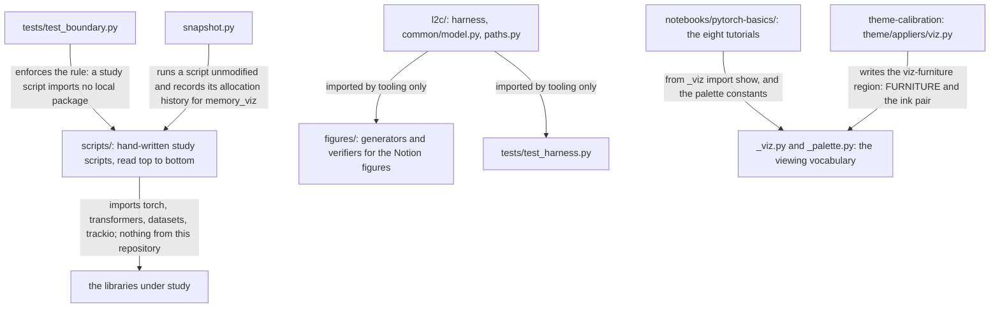
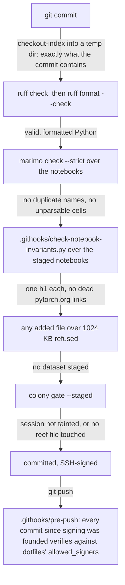

# loop-to-cluster, the architecture

> **What this is.** The mechanism of loop-to-cluster for a cold reader: what the repository is
> now that the theme program has its own repository, what may import what, how the notebooks
> draw, and what the hooks refuse. Drawn, one claim per figure, every arrow labelled with what
> moves; a table wherever a sentence beats a picture. **Who keeps it true.** A sibling whose
> branch changes a component updates the affected figure or row on the same branch, in its
> `Report:` commit; the hippocampus session checks the report against the diff at merge. **What
> tests it.** The reef physical (`physical.py` beside the titus-preferences skill in dotfiles)
> resolves every path and command named here against the tree, so a stale report fails the
> physical instead of misleading a reader. GitHub draws the figures from the fences below; the
> rendered page draws the same text.

## 1. What it is

A lab for learning distributed training, from a single-GPU loop to a sharded multi-GPU one,
predicting numbers before measuring them. The notes are Titus's, in Notion; this repository
holds what runs. The theme program grew up here and left on 2026-09-04 for
`~/src/theme-calibration`; its one remaining trace is the measured region that project writes
into `notebooks/pytorch-basics/_palette.py`.

*Two worlds that never import each other: a study script stands alone so it can change without disturbing the baseline it is compared against; everything else shares, so measurements stay comparable.*

| place | holds |
| --- | --- |
| `scripts/` | the study scripts, one concept each; `scripts/00-basic-loop.py` is the baseline every later one is compared against. Titus's own; ask before staging anything there |
| `snapshot.py` | records where GPU memory goes during a run of any script, unmodified, for the memory visualizer |
| `l2c/harness/` | measurement primitives shared so numbers stay comparable: device timing and the four memories (`l2c/harness/measure.py`), the saved-tensor ledger (`l2c/harness/ledger.py`), the arithmetic that predicts model states to the byte (`l2c/harness/predict.py`), the comparison table (`l2c/harness/report.py`), one JSON file per run (`l2c/harness/runs.py`) |
| `l2c/common/model.py`, `l2c/paths.py` | a SmolLM2-135M-shaped model built from a config, never a checkpoint; where benchmark output lands |
| `figures/` | `figures/make_figures.py` generates every figure in the house style of `figures/figstyle.py`; `figures/verify_params.py` and `figures/verify_facts.py` ground-truth the numbers; `figures/out/` holds the rendered PNGs, tracked |
| `bench/` | generated run output and memory snapshots |
| `notebooks/pytorch-basics/` | the tutorial series as marimo notebooks, and the two modules they draw with. Titus's; ask before staging anything there |
| `tests/` | the boundary rule and the harness arithmetic |
| `DECISIONS.md`, `README.md`, `CLAUDE.md` | choices and their reasons; how to run it; how to work here, including the queue |

## 2. The notebooks

Eight PyTorch tutorials converted to marimo and rewritten as teaching documents. The upstream
baseline is commit `891febb`, so `git diff 891febb -- <notebook>` shows everything ours against
everything inherited. A notebook is a Python file: each cell is a function, its last expression
renders, and `hide_code=True` is the only folding the file knows. Display plumbing lives in
hidden cells; the narrative stays visible. The judgment for working on them is
`.claude/skills/marimo-notebooks/SKILL.md` with the teaching craft in
`.claude/skills/marimo-notebooks/pedagogy.md`; observing a run is `.claude/skills/observe/SKILL.md`.

| notebook | title |
| --- | --- |
| `notebooks/pytorch-basics/01-quickstart.py` | Quickstart |
| `notebooks/pytorch-basics/02-tensors.py` | Tensors |
| `notebooks/pytorch-basics/03-datasets-and-dataloaders.py` | Datasets and DataLoaders |
| `notebooks/pytorch-basics/04-transforms.py` | Transforms |
| `notebooks/pytorch-basics/05-build-model.py` | Build the Neural Network |
| `notebooks/pytorch-basics/06-autograd.py` | Automatic Differentiation with torch.autograd |
| `notebooks/pytorch-basics/07-optimization-loop.py` | Optimizing Model Parameters |
| `notebooks/pytorch-basics/08-save-load-run.py` | Save and Load the Model |

Every notebook runs on the environment the lock file describes, from inside the notebooks
directory so that its data root is relative to it; the editor's kernel picker is the wrong
tool when a parent folder is open.

## 3. The viewing vocabulary

How a tensor or a chart looks is decided once, in two modules every notebook imports, so a
hand-tuned hex value in a notebook is a bug.

| name | what it is | decided by |
| --- | --- | --- |
| `OKABE_ITO`, `BASE`, `ACCENT` | the categorical palette designed for colour-vision deficiency, and the two-role pair most charts need: the thing itself and the thing pointed at | the field's palette; ranked under Titus's fitted observer in theme-calibration's gallery |
| `RAMP`, `SEQUENTIAL_SCHEME` | cividis at five stops, and its Vega name; magnitude is carried by lightness and only by lightness | the same |
| `POLARITY`, `DIVERGING_SCHEME` | the blue-orange diverging ramp, dark at both ends | the same |
| `INK_LIGHT`, `INK_DARK`, `FURNITURE` | the ink on a coloured data fill (the two papers), and a chart's furniture per polarity: paper, page, ink, label, grid, axis | the measured palette; written by theme-calibration's applier into the `viz-furniture` region, never by hand |
| `tint` | a palette hue mixed toward a card's white, for renderers that cannot take scheme names | derived |
| `show` | renders a small tensor as its own numbers, each square coloured by magnitude, ink chosen per square at measured crossovers (white below 0.48 of the sequential scale, above 0.71 of either diverging arm), a transparent canvas so the page's colour shows, and a caption with shape, dtype and stride | `notebooks/pytorch-basics/_viz.py` |

`_palette.py` is importable without torch, because a marimo run session instantiates in a
worker thread where importing torch can die mid-import; `_viz.py` re-exports every constant so
notebooks keep one entry point.

## 4. The hooks

`.githooks/pre-commit` is the formatting standard and enforces itself; activate it once per
clone with `git config core.hooksPath .githooks`. It checks the index, never the working tree:
unstaged notebook work in an open editor can never fail a commit it is not part of.

*The hook refuses in a fixed order and judges the staged snapshot; the push gate lets nothing unsigned leave the machine.*

Commits go straight to main by this repository's own rule (`CLAUDE.md`), staged by explicit
path and committed in the same command, because the index is shared with every parallel
session. Every commit or batch is pushed at once.
