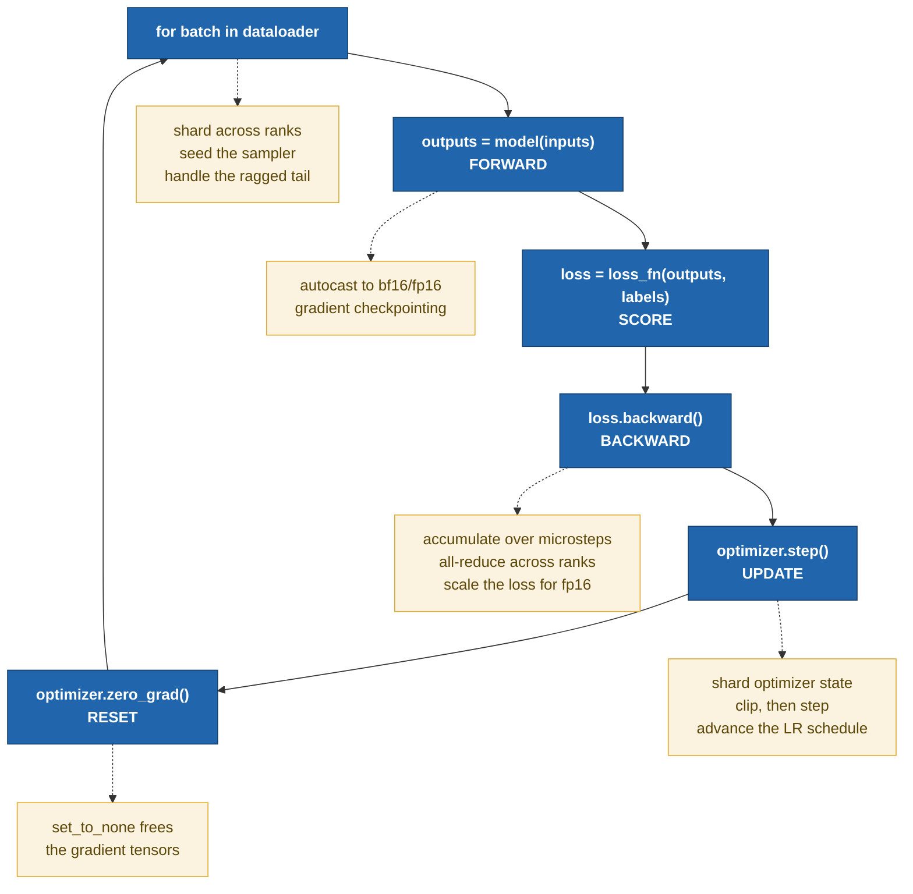
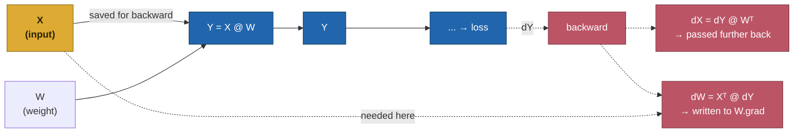
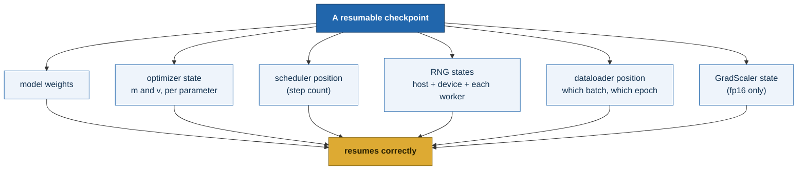

<callout icon="🧭" color="blue_bg">
	**Start here.** Everything in this wiki is a modification to the loop on this page. Read this one first, in full. The other pages assume it.
</callout>

Training a neural network is a search. You have a model containing some quantity of adjustable numbers, a pile of examples, and a way of scoring how wrong the model currently is. You show it a handful of examples, measure the wrongness, work out which direction each adjustable number should move to make the wrongness smaller, and nudge every one of them a short distance in that direction. Then you do it again, a few hundred thousand times.

Everything below elaborates that sentence. The **forward pass** is *measure the wrongness*. The **backward pass** is *work out which direction*. The **optimizer** is *nudge them*. The memory arithmetic is bookkeeping for the fact that all those numbers have to physically live somewhere while it happens, and there are more of them than you would guess.

---

## The loop

Every neural network training program, from a two-parameter toy to a frontier model, is the same eight lines:

```python
for epoch in range(num_epochs):
    for batch in dataloader:
        outputs = model(batch.inputs)          # forward
        loss = loss_fn(outputs, batch.labels)  # score
        loss.backward()                        # backward
        optimizer.step()                       # update
        optimizer.zero_grad()                  # reset
```

Everything else in modern training — mixed precision, gradient accumulation, **DDP** (Distributed Data Parallel), **FSDP** (Fully Sharded Data Parallel), **ZeRO** (Zero Redundancy Optimizer) — is a modification to one of those five lines. That is the organizing idea of this wiki: not "here is a pile of techniques" but "here is one loop, and here are the five places you can intervene."



Some vocabulary before we go further, because these words get used loosely and the looseness causes real confusion later.

A **parameter** (or *weight*) is a number the model learns. A 1-billion-parameter model has a billion of them. A **sample** is one training example. A **batch** (or *mini-batch*) is a group of samples processed together. A **step** (or *iteration*) is one execution of the loop body — one weight update. An **epoch** is one full pass over the dataset. Steps, not epochs, are the unit that matters mechanically; epochs are just bookkeeping.

**Convergence** means the loss has stopped meaningfully decreasing — the search has settled. "Does it converge?" is the weakest useful question you can ask of a training run, and correspondingly the most robust thing to assert in a test.

<details>
<summary>🔍 **Interrogate this section**</summary>
	| | |
	|---|---|
	| **Why invented** | Gradient descent is the only method that scales to billions of parameters: it needs one derivative per parameter, not a search over combinations. |
	| **Connects to** | Everything. Each later page is one of the five dotted boxes above. |
	| **Fails silently** | A loop that runs and produces a falling loss can still be wrong — wrong shift on the labels, wrong reduction, contaminated eval. It will look fine. |
	| **Assert in a test** | Loss decreases over N steps; two seeded runs agree bitwise; the initial loss equals ln(V). |
	| **Costs** | About 3 forward passes of arithmetic per step (see *Memory and compute*). |
	| **Owned by** | Your code. `accelerate` does not own the loop — it owns what happens inside four of its lines. |
</details>

---

## Initialization: why the first step is special

Before the loop runs once, every parameter has to hold *something*. That something is not zero — a network of all zeros has identical gradients everywhere and can never break symmetry between units.

Llama-style models, this one included, initialize every weight from a normal distribution with standard deviation `initializer_range`, which is **0.02**. That single number applies to the embedding table, every projection matrix, and the deepest layer alike. The **RMSNorm** scales start at exactly 1.0, so normalization begins as an identity operation.

<callout icon="⚠️" color="yellow_bg">
	Worth knowing what is *absent*: there is no depth-scaled residual initialization here. GPT-2 divides the residual projections by √(2·n_layer) so that the residual stream does not grow with depth. In this architecture layer 29's `down_proj` is initialized with exactly the same standard deviation as layer 0's. That is a real difference between model families and a plausible source of instability at depth.
</callout>

Initialization is the missing link between three things that otherwise look unrelated: **why the initial loss is ln(V)** (below), **why early steps are fragile** (a random model produces large, poorly-conditioned gradients), and **why warmup exists** (to take small steps until the model is no longer random).

---

## The cheapest correctness check you will ever run

A randomly initialized language model knows nothing. Asked to predict the next token, it should be equally unsure across the whole vocabulary. Cross-entropy against a uniform distribution over **V** classes is exactly **ln(V)**.

$$
\mathcal{L}_{\text{init}} \;=\; -\ln\!\left(\tfrac{1}{V}\right) \;=\; \ln V
$$

For this model's vocabulary of 49,152 tokens, that is **ln(49,152) = 10.8027**.

Run a forward pass on pristine weights and you should land near it. Here is what actually happens:

| | |
|---|---|
| Predicted, ln(49,152) | **10.8027** |
| Measured, batch of 2 × 128 random tokens | **10.9513** |
| Difference | **+0.1486** |

<callout icon="🎯" color="blue_bg">
	**Note the direction.** The measured value is *above* ln(V), not equal to it, and that is expected rather than a bug. ln(V) is the cross-entropy of a *perfectly uniform* distribution. A randomly initialized model does not produce perfectly uniform logits — it produces logits with a small spread, and any spread raises cross-entropy above the uniform floor. So ln(V) is a **floor that a fresh model approaches from above**, not a value it hits.

	This matters for what you write in a test. `assert loss == log(V)` fails. `assert abs(loss - log(V)) < 0.25` passes and still catches everything worth catching.
</callout>

What this check catches, in about one second: a mis-shifted label tensor, a wrong reduction, an accidentally-loaded pretrained checkpoint, a vocabulary-size mismatch between tokenizer and model, and a loss computed over padding it should have ignored. All of those produce an initial loss that is obviously wrong — far below ln(V) if the model is accidentally pretrained, far above if the labels are misaligned.

It must be read on **pristine** weights. One AdamW step moves every parameter by roughly the learning rate, which is small enough that a contaminated reading still looks plausible — the worst kind of broken check.

<details>
<summary>🔍 **Interrogate this section**</summary>
	| | |
	|---|---|
	| **Why invented** | It is the only point in training where you know the correct answer analytically, before measuring anything. |
	| **Connects to** | Initialization (above) determines it; the loss curve on *Mixed precision* starts from it. |
	| **Fails silently** | Skipping it. Every downstream number is then unverified, and a broken loss still produces a plausible-looking falling curve. |
	| **Assert in a test** | `abs(initial_loss - math.log(vocab_size)) < 0.25`, on a model that has taken zero optimizer steps. |
	| **Costs** | One forward pass. |
	| **Owned by** | Your code — no framework does this for you. |
</details>

---

## Forward: computing the prediction, and quietly recording how

The **forward pass** feeds the input through the network layer by layer and produces an output. For a language model: token IDs go in, a score for every vocabulary entry comes out at every position.

### What "layer by layer" actually means

The token IDs first hit an **embedding table** — a large lookup matrix mapping each token ID to a vector of `hidden_size` numbers. From that point on, the data flowing through the network is a tensor of shape `(batch, sequence, hidden)`, and it keeps that shape all the way to the end.

That tensor then passes through a stack of identical **transformer blocks** — 30 of them in this model, 32 in a 7B. Each block does two things in sequence, each wrapped in a **residual connection** (add the block's input back to its output) and preceded by a **normalization**:

1. **Attention.** The input is multiplied by three learned matrices to produce **queries**, **keys** and **values**. Q times Kᵀ gives a `(sequence × sequence)` matrix of attention scores — how much each position attends to each other position. **Softmax** turns each row into weights summing to one. Those weights multiply V, and a fourth matrix projects back to `hidden_size`.
2. **MLP** (feed-forward). One matrix expands `hidden_size`, an **activation function** is applied elementwise (GELU, SwiGLU — a nonlinearity, without which stacking layers would collapse into a single linear map), and a second matrix contracts back down.

After the final block, the **language-modeling head** projects from `hidden_size` to vocabulary size.

<callout icon="📐" color="gray_bg">
	**Normalization here is RMSNorm, not LayerNorm.** LayerNorm subtracts the mean, divides by the standard deviation, then applies a learned scale *and* shift. RMSNorm skips the mean-centering and the shift entirely: it divides by the root-mean-square and applies a learned scale only. Cheaper, one fewer reduction, and empirically just as stable. Every "layer norm" in a Llama-family model is an RMSNorm — including all 61 in this one.
</callout>

Three things to take from that, each of which pays off later:

**It is overwhelmingly matrix multiplies.** Six large weight matrices per block — four in attention, two in the MLP, or three if the MLP is *gated* as SwiGLU is — plus two activation-times-activation matmuls inside attention itself. Everything else is elementwise arithmetic and two normalizations. The matmuls dominate both the parameter count and the **FLOPs** (floating-point operations). That is the entire reason mixed precision works: hardware that accelerates 16-bit matrix multiplication accelerates nearly all of the real work.

**The non-matmul operations are the numerically delicate ones.** Softmax and normalization are *reductions* — they sum across a dimension. These are precisely the operations autocast keeps in fp32: cheap enough that full precision costs almost nothing, fragile enough that lowering them would hurt.

**Attention carries a term that scales with sequence *squared*.** That `(sequence × sequence)` score matrix exists per head, per layer. Everything else scales linearly with sequence length; this one does not. It is why long-context training gets expensive so abruptly.

### The recording

That is the obvious job. The non-obvious job — and the one that dominates memory — is that PyTorch is simultaneously building a record of everything it did.

As each operation runs, PyTorch appends a node to a **computational graph**: a directed record of which tensors were produced by which operations from which inputs. Each output tensor carries a `grad_fn` pointing at the operation that made it. This is **autograd**, and the graph is built dynamically, as the code executes.

To later compute gradients, the graph must retain the intermediate tensors the derivative formulas need. These retained intermediates are called **activations**.



This is the single most important memory fact in training: **activations are not a side effect, they are a stored dataset, and they scale with batch size and sequence length, not with model size.** It is why `torch.no_grad()` cuts inference memory so dramatically, and why gradient checkpointing exists at all.

<details>
<summary>🔍 **Interrogate this section**</summary>
	| | |
	|---|---|
	| **Why invented** | Reverse-mode autodiff needs a record of the forward computation to replay in reverse. Building it dynamically is what makes Python control flow work inside a model. |
	| **Connects to** | Activation memory on *Memory and compute*; autocast on *Mixed precision* changes the dtype of exactly these saved tensors. |
	| **Fails silently** | Forgetting `torch.no_grad()` in eval: the graph is still built, memory quietly doubles, and nothing errors. |
	| **Assert in a test** | Peak memory under `no_grad` is materially below peak memory with grad enabled; output dtype under autocast is the reduced dtype. |
	| **Costs** | The activations. Usually the largest single term at training time, and the one you actually control. |
	| **Owned by** | `torch.autograd`. |
</details>

---

## Loss: collapsing everything to one number

The **loss function** compares the model's output to the correct answer and returns a single scalar. For causal language modeling it is cross-entropy: roughly, "how surprised was the model by the token that actually came next," averaged over every position in the batch.

It must be a single number, because the gradient is *the derivative of that number with respect to every parameter*, and derivatives need a scalar output. This sounds like a technicality; it is not. The fact that the loss is an *average* over tokens is precisely the detail that makes gradient accumulation subtly wrong when sequences have different lengths. **Averages of averages are not averages.**

---

## Backward: the chain rule, run in reverse

`loss.backward()` walks the computational graph from the loss back to the inputs, applying the chain rule at each node. This is **backpropagation** — mathematically, *reverse-mode* automatic differentiation, meaning it starts from the single output and works back toward the many inputs, which is the efficient direction when you have one loss and a hundred million parameters.

The output is a **gradient** for every parameter: a number saying "if you nudge this weight up slightly, the loss changes by this much, in this direction." Gradients have exactly the same shape and count as the parameters.

### A worked example, with actual numbers

The matmul case is the one worth carrying in your head. Forward computed `Y = X @ W`. Take the smallest example that is not trivial — two samples, two input features, two output features:

$$
X = \begin{bmatrix} 1 & 2 \\ 3 & 4 \end{bmatrix}
\qquad
W = \begin{bmatrix} 5 & 6 \\ 7 & 8 \end{bmatrix}
\qquad
Y = XW = \begin{bmatrix} 19 & 22 \\ 43 & 50 \end{bmatrix}
$$

Backward arrives carrying `dY`, the gradient of the loss with respect to this operation's output. Suppose it is:

$$
dY = \begin{bmatrix} 1 & 0 \\ 0 & 1 \end{bmatrix}
$$

Two results come out, and only one of them is what you were after:

$$
dX = dY\,W^{\mathsf{T}} = \begin{bmatrix} 5 & 7 \\ 6 & 8 \end{bmatrix}
\qquad\text{(passed further back)}
$$

$$
dW = X^{\mathsf{T}}dY = \begin{bmatrix} 1 & 3 \\ 2 & 4 \end{bmatrix}\begin{bmatrix} 1 & 0 \\ 0 & 1 \end{bmatrix} = \begin{bmatrix} 1 & 3 \\ 2 & 4 \end{bmatrix}
\qquad\text{(written into \texttt{W.grad})}
$$

Now look at what `dW = XᵀdY` actually required. It needed **X** — the forward input. Not W, not Y, not anything computed later. **X**, which was consumed by the forward pass and would otherwise be garbage.

That is the whole of activation memory, in one equation. The graph keeps X because this formula cannot run without it. Every "activations are expensive" claim on every other page reduces to this.

Three more consequences fall out of the same two lines:

**Cost.** Two matrix multiplies out for every one in. Backward is roughly twice the arithmetic of forward, so a full training step costs about three forward passes. That ratio is the origin of the `6ND` rule on *Memory and compute*.

**Where peak memory occurs.** Activations are freed as backward consumes them, layer by layer. The high-water mark therefore sits at the forward/backward boundary — everything stored, nothing yet released.

**Why residual connections help.** Addition passes the incoming gradient to *both* branches unchanged. That is the mechanism by which gradient reaches early layers without attenuating.

### Where the gradients land

PyTorch writes each gradient into the parameter's `.grad` attribute. One detail with outsized consequences: it **accumulates** rather than overwrites — `.grad += new_gradient`, not `.grad = new_gradient`.

This trips up everyone once, and it is also the entire mechanism behind gradient accumulation. Run forward and backward several times before stepping, and the gradients sum, giving the effect of a larger batch without the memory of one. The feature and the footgun are the same line of code.

<details>
<summary>🔍 **Interrogate this section**</summary>
	| | |
	|---|---|
	| **Why invented** | Reverse mode computes all N derivatives in one traversal. Forward mode would need N traversals — impossible at 10⁸ parameters. |
	| **Connects to** | `dW = XᵀdY` is why activations are stored, which is the activation term in *Memory and compute*. Accumulation is what gradient accumulation and DDP both exploit. |
	| **Fails silently** | Forgetting `zero_grad()`. Gradients keep summing across steps; the model still trains, just on a corrupted gradient, and nothing errors. |
	| **Assert in a test** | Two backward passes without zeroing produce exactly 2× the gradient of one; `torch.autograd.gradcheck` on a small module. |
	| **Costs** | ~2× the forward FLOPs, plus holding all gradients live simultaneously at the end. |
	| **Owned by** | `torch.autograd`. `Accelerator.backward` wraps it — and divides by `gradient_accumulation_steps` on the way through. |
</details>

---

## Zeroing: why you must clean up

Because gradients accumulate, they must be explicitly cleared, or step 2 updates using the sum of steps 1 and 2. `optimizer.zero_grad()` does this. Modern PyTorch defaults to `set_to_none=True`, which frees the gradient tensors entirely rather than filling them with zeros — slightly faster, and it releases memory between steps.

---

## What the loop leaves out

Three things belong in your mental model even though they are not in the eight lines.

**Mode switching.** `model.train()` and `model.eval()` toggle layers that behave differently during training and inference — dropout is active in one and disabled in the other. Evaluation should additionally run inside `torch.no_grad()`, which skips graph construction and therefore skips storing activations.

**Determinism.** Two identical runs will not produce identical numbers unless you seed every source of randomness — weight initialization, dropout, data shuffling — and constrain nondeterministic GPU kernels. Normally a nicety; for integration testing it is load-bearing.

**The full training state.** Newcomers think a checkpoint is the model weights. It is not.



Every box that is missing produces a resume that runs, reports plausible numbers, and is quietly wrong. That list is precisely why checkpoint/resume is the most interesting thing to test in a distributed training library: it is the piece with the most ways to be incompletely implemented.

<details>
<summary>🔍 **Interrogate this section**</summary>
	| | |
	|---|---|
	| **Why invented** | Long runs get preempted. Resume has to be exact, or the run you resumed is not the run you started. |
	| **Connects to** | Optimizer state on *The optimizer*; dataloader position on *The dataloader*; scaler state on *Mixed precision*. |
	| **Fails silently** | This is the canonical silent failure in the whole wiki. Every omitted component still resumes, still trains, still reports a falling loss. |
	| **Assert in a test** | Train 10 steps; checkpoint at 5, resume, finish. The final weights must match an uninterrupted 10-step run bitwise. |
	| **Costs** | Disk equal to roughly the model-states figure — 16 bytes per parameter for fp32 AdamW. |
	| **Owned by** | Split. torch owns each `state_dict`; `accelerate` owns collecting them (`save_state` / `load_state`); you own remembering the dataloader. |
</details>

---

## Retrieval practice

<callout icon="🧠" color="green_bg">
	Answer these **out loud, from memory, before expanding them**. Producing an answer cold is what moves it into long-term memory; recognizing a correct answer does almost nothing. Getting one wrong and then seeing the answer beats getting it right by rereading.
</callout>

<details>
<summary>**1.** Why must activations be stored? Give the equation.</summary>
	Because `dW = Xᵀ @ dY` requires **X**, the forward input to that operation. X is consumed during forward and would be freed; autograd retains it precisely so this formula can run. The gradient with respect to a weight always depends on that layer's input.
</details>

<details>
<summary>**2.** A randomly initialized model with a 49,152-token vocabulary — what loss should the first forward pass report, and what would you actually assert?</summary>
	**ln(49,152) = 10.8027**, approached from slightly above — the measurement here was 10.9513, because random init gives non-uniform logits and any spread raises cross-entropy above the uniform floor. Assert `abs(loss - ln(V)) < 0.25`, not equality.
</details>

<details>
<summary>**3.** You forget `optimizer.zero_grad()`. What breaks, and how would you find out?</summary>
	Nothing errors. `.grad` accumulates across steps, so step *n* updates using the sum of all gradients so far — an effectively exploding learning rate. The loss usually destabilizes but may just train badly. You find it by asserting that two backward passes without zeroing give exactly 2× the gradient of one.
</details>

<details>
<summary>**4.** Name the six things a checkpoint needs to resume exactly. Which is most often forgotten?</summary>
	Weights, optimizer state (m and v), scheduler position, RNG states, dataloader position, and the GradScaler state under fp16. **Dataloader position** is most often forgotten — it lives inside a Python iterator, not on disk, and omitting it silently restarts the epoch at the wrong place.
</details>

<details>
<summary>**5.** Why is backward roughly twice the cost of forward?</summary>
	Each forward matmul `Y = X @ W` produces two backward matmuls of comparable size: `dX = dY @ Wᵀ` and `dW = Xᵀ @ dY`. Two out for one in, hence ~2×, hence ~3 forward passes for a full step — the origin of `6ND`.
</details>
